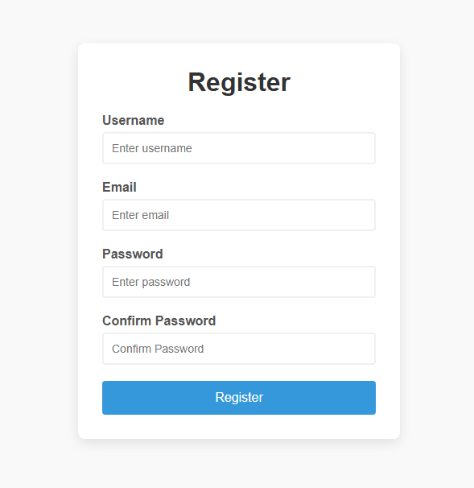

# 🧪 Form Validator

A responsive and interactive client-side **registration form validator** built using **HTML**, **CSS**, and **JavaScript**. This project demonstrates real-time form validation and visual feedback without using any libraries or frameworks.

## 🚀 Features

- ✅ Instant validation on form submission
- ⚠️ Field-level error and success feedback
- 📧 Email format validation
- 🔒 Password match validation
- 📏 Username and password length constraints
- 📱 Responsive design with clean UI

## 🛠️ Validation Rules

| Field            | Rule                            |
|------------------|---------------------------------|
| Username         | Required, 3–15 characters       |
| Email            | Required, valid email format    |
| Password         | Required, 6–25 characters       |
| Confirm Password | Must match the password         |

## 📸 Preview

